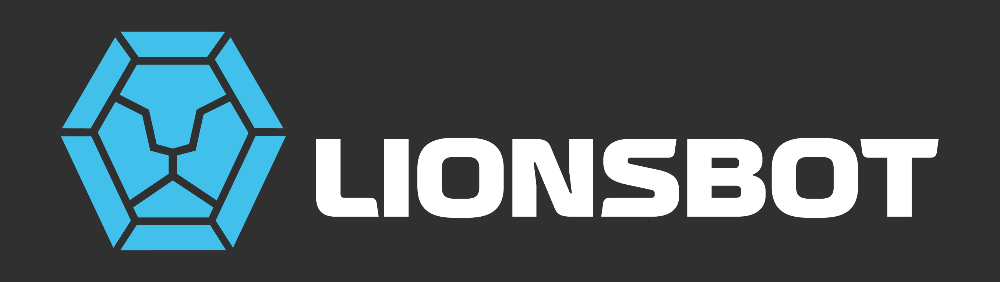

# LionsBot Open-RMF Fleet Adapter


This repository connects LionsBot robots to [Open-RMF](https://www.open-rmf.org/). It includes site maps, per-fleet configuration, an RMF launch stack, and the Python adapter that communicates with the LionsBot API.

Tested with:

| Ubuntu version | ROS version |
| --- | --- |
| 24.04 | ROS 2 Jazzy |

Currently, fleet adapters are developed and have been tested for these supported families of robots:

| Robot family | Robot type |
| --- | --- |
| R3 | Vac, Scrub Pro |
| R5 | R5 |
| REX | Testing in progress |

## Table of contents

- [Quick start](#quick-start)
- [Repository guide](#repository-guide)
- [Maps and visualisation](#maps-and-visualisation)
- [Development](#development)
- [RMF map creation workflow](#rmf-map-creation-workflow)
- [FAQ and troubleshooting](#faq-and-troubleshooting)
- [Installation and references](#installation-and-references)
- [Future improvements](#future-improvements)

## Quick start

The runnable ROS package is [`fleet_adapter/`](fleet_adapter/). Local startup is split into two scripts: [`run_fleet.sh`](fleet_adapter/run_fleet.sh) builds the package and starts RMF core, RViz, and RMF Web; [`run_fleet_adapter.sh`](fleet_adapter/run_fleet_adapter.sh) starts one selected fleet adapter.

1. Install ROS 2 Jazzy, Open-RMF dependencies, Docker Compose, and `rosdep`. If these are not installed yet, see [Installation and references](#installation-and-references) below.
2. Create the local environment file and enter LionsBot credentials:

   ```bash
   cd fleet_adapter
   cp .env.example .env
   ```

> The example configuration defines two fleet adapters for different robot types (a heterogeneous fleet). Start each desired adapter separately with `./run_fleet_adapter.sh <fleet_number>`.

3. In `.env`, select the site and the two fleet configurations:

   ```dotenv
   FOLDER_NAME=office_new
   FLEET_1_CONFIG=config_r5.yaml
   FLEET_1_NAV_GRAPH=0.yaml
   FLEET_2_CONFIG=config_r3scp.yaml
   FLEET_2_NAV_GRAPH=1.yaml
   ```

   `FOLDER_NAME` must be the name of a matching directory in both [`maps/`](fleet_adapter/maps/) and [`configs/`](fleet_adapter/configs/). For example, `office_new` selects `maps/office_new/` and `configs/office_new/`.

4. In one terminal, build and start RMF core, RViz, and RMF Web:

   ```bash
   ./run_fleet.sh
   ```

   The script loads `.env`, runs `rosdep`, builds with `colcon`, launches RMF core and RViz, and starts RMF Web.

5. In a separate terminal, choose one way to start an adapter. The [Docker setup](fleet_adapter/docker/) packages the adapter only; keep `run_fleet.sh` running to provide RMF core and RMF Web.

   **Option 1 — run directly:** start an adapter by fleet number:

   ```bash
   cd fleet_adapter
   ./run_fleet_adapter.sh 1
   ```

   Use `./run_fleet_adapter.sh 2` for the second fleet. The number selects the matching `FLEET_<number>_CONFIG` and `FLEET_<number>_NAV_GRAPH` entries in `.env`, so each adapter can be run, stopped, and debugged independently.

   **Option 2 — run with Docker Compose:** build the image, then start the adapter. This example starts fleet 1; replace the environment-variable references with fleet 2's values to start fleet 2.

   ```bash
   cd fleet_adapter
   FLEET_CONFIG="$FLEET_1_CONFIG" NAV_GRAPH="$FLEET_1_NAV_GRAPH" \
     docker compose -f docker/docker-compose.yaml build
   FLEET_CONFIG="$FLEET_1_CONFIG" NAV_GRAPH="$FLEET_1_NAV_GRAPH" \
     docker compose -f docker/docker-compose.yaml up
   ```

Local ROS logs are written below [`fleet_adapter/log/`](fleet_adapter/log/). Use `Ctrl+C` in the `run_fleet.sh` terminal to stop RMF launch processes and RMF Web containers, and separately in each adapter terminal to stop that adapter.

## Repository guide

```text
fleet_adapter/
├── configs/
│   ├── <building_name>/        Fleet YAML files, one per robot model/fleet
│   └── visualization/         RViz and RMF Web visualisation settings
├── maps/<building_name>/       Building map, nav graphs, dock summary, robot map assets
├── fleet_adapter/              Python adapter package
│   ├── fleet_adapter.py        Main adapter: parses config and registers fleet/robots with RMF
│   ├── LionsbotRobot.py        RMF robot command handling
│   ├── RobotClientAPI.py       LionsBot HTTP/WebSocket client
│   ├── enums/                  Shared constants and enums
│   └── models/                 Typed payload/domain models for robot operations
├── launch/                     RMF core, RViz, and RMF Web launch/Compose definitions
├── docker/                     Standalone fleet-adapter container assets (not RMF core/Web)
├── .env.example                Local runtime settings and credential template
├── setup.py                    Python package metadata and ROS 2 console entry points
└── package.xml                 ROS 2 package dependencies
```

The `fleet_adapter` console command is configured in [`setup.py`](fleet_adapter/setup.py); the other entry points provide the building and robot-marker visualisers. ROS 2 dependencies belong in [`package.xml`](fleet_adapter/package.xml).

## Maps and visualisation

- For the detailed map-creation workflow, see [RMF map creation workflow](#rmf-map-creation-workflow).
- Each building directory in `maps/` contains the RMF building map, exported navigation graphs, `dock_summary.yaml`, and robot map assets.
- The LionsBot API converts the building map, fleet configuration, and robot map supplied to it into the RMF map data used in this workflow.
- The RMF launch file is [`launch/rmf.launch.xml`](fleet_adapter/launch/rmf.launch.xml).
- Customise RViz and RMF Web presentation in [`configs/visualization/`](fleet_adapter/configs/visualization/).
- The standalone Docker setup in [`docker/`](fleet_adapter/docker/) packages only the fleet adapter; RMF core and RMF Web are launched by the assets in [`launch/`](fleet_adapter/launch/).

## Development

For an adapter-only loop, source your ROS workspace, and run the adapter directly after building:

```bash
ros2 run fleet_adapter fleet_adapter \
  -c configs/<building_name>/<fleet_config>.yaml \
  -n maps/<building_name>/<graph_idx>.yaml \
  -d maps/<building_name>/dock_summary.yaml \
  --server_uri ws://localhost:8000/_internal
```

Use the [`fleet_adapter/fleet_adapter/`](fleet_adapter/fleet_adapter/) package for runtime behavior, [`enums/`](fleet_adapter/fleet_adapter/enums/) and [`models/`](fleet_adapter/fleet_adapter/models/) for shared domain definitions, and the `test/` directories for unit tests. The runner expands environment variables in configuration files; direct invocations should use a configuration with credentials already expanded or run through an equivalent environment-expansion step.

## RMF map creation workflow

### Placeholder legend

- `<building_name>`: the building directory name under both `maps/` and `configs/`.
- `<rmf_map_name>`: the RMF map name used for `<rmf_map_name>.building.yaml`.
- `<robot_map_name>`: the LionsBot robot-map name supplied to the LionsBot API.
- `<graph_idx>`: the navigation-graph index used for `<graph_idx>.yaml`.
- `<level_name>`: the RMF level name used in the building map and map transform configuration.

All map and configuration paths include `maps/<building_name>/` or `configs/<building_name>/`; generated building maps, dock summaries, and exported navigation graphs are stored in the corresponding `maps/<building_name>/` directory.

From the building map, `config_<robot_type>.yaml`, and a LionsBot robot map to an `<rmf_map_name>.building.yaml` + `dock_summary.yaml`, and the fleet nav graph `<graph_idx>.yaml`:

### Overview

```text
 robot map from LionsBot robot
     │                        
     │                       
     │          Traffic editor pass 1 --> <rmf_map_name>.building.yaml (scale, naming, and transform)
     │                        │
     │                        v
     └────────────────> Lionsbot API <──── configs/<building_name>/config_<robot_type>.yaml
                             │
                             ├── <rmf_map_name>.building.yaml + named POIs / docks / zone anchors
                             └── dock_summary.yaml (clean paths)
                             └── <rmf_map_name>.building.yaml (updated)
                                     │
                                     v
                        Traffic editor pass 2 --> <rmf_map_name>.building.yaml (connect new points to lanes)
                                                        │
                                                        v
                                           building_map_generator nav --> <graph_idx>.yaml
```

### 0. Prerequisites

- **Inputs:** a LionsBot robot map, `config_<robot_type>.yaml`, and the floorplan image used to create the RMF building map
- **Assets:** floorplan `.png` file
- **Tooling:** [`rmf_traffic_editor`](https://github.com/open-rmf/rmf_traffic_editor)

### 1. Traffic editor — pass 1

Install `traffic-editor` following instructions in this [repo](https://github.com/open-rmf/rmf_traffic_editor), then:

```bash
source install/setup.bash
traffic-editor
```
- Create a new `<rmf_map_name>.building.yaml`, use reference-image coordinates.


- Add a **level** with `<level_name>` (we will use L8 as an example), attach the floorplan image.

 

- Add **at least one measurement** between two points with a real-world distance. Save and restart `traffic-editor` and the scale will be updated. 

 

- This scale will be your `map_transform.<level_name>.transform_values.scale` value (`rotation_degrees`, `tx_meters`, and `ty_meters` will be 0 for the 1st / global map).


- Add **at least one wall** for RMF Web to render the map.


- Save `maps/<building_name>/<rmf_map_name>.building.yaml` (for example, `maps/office/L3_pantry.building.yaml`).
- **Do not** add vertices for docks, POIs, or cleaning zones.

Output: `<rmf_map_name>.building.yaml`.

#### 1.1 Adding maps with different orientation and size
For heterogenous fleets, it is highly likely we have a map of a different scale and orientation that we will need ot align with the global map RMF refers to.

- Add the new map as a 2nd layer on top of the reference map. For Lionsbot's maps, set the scale to 0.05 for a good starting point. Adjust the rotation and translation until the new map is relatively close to the original map.


- Mark matching featuers on both layers and draw constraint pairs. 

 

- Press `Ctrl + T` to align the maps after matching all pairs.

 

- Populate (1) `rotation_degrees`, (2) `scale` (meters per picel), (3) `tx_meters`, and (4) `ty_meters` in `config_<robot_type>.yaml`, at `map_transform.<level_name>.transform_values`. These values can be obtained from layers -> edit (choose the map added).


### 2. LionsBot API

Provide the LionsBot API with the current `<rmf_map_name>.building.yaml`, `config_<robot_type>.yaml`, and the robot map obtained from the robot. The API adds the named vertices for markers, cleaning zones, and custom paths to the building file and creates or updates `maps/<building_name>/dock_summary.yaml`. When a name already exists, it updates that vertex's position (and a dock's heading) in place, preserving its name, properties, and graph connectivity.

Note: Repeat this API step on the same `<rmf_map_name>.building.yaml` for different robot maps, robot types, or levels.
- For heterogeneous fleets: provide the relevant robot map and `config_<robot_type>.yaml`
- For different levels: change `<level_name>` 

Outputs: updated `<rmf_map_name>.building.yaml` and `dock_summary.yaml`.

### 3. Traffic editor — pass 2

- Reopen the updated `<rmf_map_name>.building.yaml` with the added points.


- Connect the added vertices (chargers, lifts, docks, cleaning zones, etc.) to the graph with **lanes**.
- For docks and cleaning-zone start points, create a nearby traffic waypoint and connect it with a short lane. Do not place these points directly on a through-traffic lane; this lets robots enter and leave without blocking passing traffic. You can use different graphs for different fleets; remember which `graph_idx` belongs to each fleet.
- Make the lane leading to a dock approximately perpendicular to represent the robot's docking orientation.

- Where practical, position vertices (waypoints, cleaning-zone start points, and docks) slightly clear of walls and other obstacles in Traffic Editor. This provides tolerance for map alignment and RMF coordinate-conversion differences.

  

- Save the building file.

### 4. Export nav graph

Per the [rmf_traffic_editor README](https://github.com/open-rmf/rmf_traffic_editor):

```bash
ros2 run rmf_building_map_tools building_map_generator nav \
  maps/<building_name>/<rmf_map_name>.building.yaml maps/<building_name>/
```
Output: `<graph_idx>.yaml`, used by the fleet adapter with the corresponding `graph_idx`.


## FAQ and troubleshooting

### Which ROS 2 DDS implementation should I use?

Cyclone DDS is preferred and has been the most reliable option in our experience. The Open-RMF maintainers have similarly reported that Cyclone DDS provided a better experience; see this [issue](https://github.com/open-rmf/rmf_demos/issues/316) for more information.

Set the following in `.env` before starting the stack:

```dotenv
RMW_IMPLEMENTATION=rmw_cyclonedds_cpp
```

Ensure the Cyclone DDS ROS package is installed (for Jazzy, `ros-jazzy-rmw-cyclonedds-cpp`) and use the same `ROS_DOMAIN_ID` and DDS implementation in every terminal and container that must communicate.

### How do I follow fleet-adapter Docker logs?

```bash
sudo docker logs -f docker-fleet-adapter-1
```

You can also view log files in `/ws/log/`, log files are prefixed `fleet_adapter_debug`.

### How do I clear lingering RMF or fleet-adapter processes?

If a previous launch did not exit cleanly, first check for leftover ROS 2, RMF,
or fleet-adapter processes:

```bash
ps -ef | grep -E '[r]os2 launch|[r]mf_|[f]leet_adapter'
```

Gracefully stop the lingering RMF and fleet-adapter processes with:

```bash
pkill -INT -f 'rmf_|fleet_adapter'
```

Run the check again before restarting the stack. Use `kill <PID>` rather than
`pkill <PID>` when stopping one specific process by its PID.

## Installation and references

- Install ROS 2 Jazzy using the [official ROS 2 Jazzy installation guide](https://docs.ros.org/en/jazzy/Installation.html).
- Install Open-RMF and its dependencies from [open-rmf/rmf](https://github.com/open-rmf/rmf).
- For fleet-adapter integration concepts and APIs, see the [RMF fleet adapter documentation](https://docs.ros.org/en/iron/p/rmf_fleet_adapter/index.html).
- For using traffic-editor, see [the official documentation](https://osrf.github.io/ros2multirobotbook/traffic-editor.html).
- For Traffic Editor workflow and deployment context, see [Scaling Open-RMF from a Test Bench → Lab → Controlled Environment → Production](https://roscon.ros.org/2024/talks/Scaling_Open-RMF_from_a_Test_Bench_%E2%86%92_Lab_%E2%86%92_Controlled_Environment_%E2%86%92_Production.pdf).

## Future improvements

### More targetted error handling 

The adapter currently retries command timeouts / reports `execution.error()` + `finished()` / sends one RMF Web
`AlertRequest` (only when a robot remains docked without charging). Future developers
can map LionsBot vendor error codes to the RMF API that best matches the
condition. Examples include but are not limited to:

| API | Scope | Changes action? | Effect |
| --- | --- | --- | --- |
| `execution.delayed(text)` | Current task event | No | Records a temporary delay and warning log; the event remains active. |
| `execution.blocked(text)` | Current task event | No | Records that progress is blocked and adds a warning log; the event remains active. |
| `execution.error(text)` | Current task event | Only if `finished()` is omitted | Records an error and error log. Calling `finished()` completes the event; omitting it prevents RMF from advancing the event. |
| `update_position(...)` + `replan()` | Robot traffic plan | Yes | Updates RMF with the latest position and requests a new route. |
| `interrupt(labels, callback)` | Whole current task | Yes | Pauses the task and yields robot control until the returned interruption handle is resumed. |
| `set_commission(Commission.decommission())` | Future task assignment | Yes, for future work | Prevents new dispatched/direct tasks and idle behaviour; it does not cancel the active task. |
| `AlertRequest` | RMF Web | No | Creates a stock RMF Web bell/popup alert with acknowledgement; it does not control the robot or task. |

### Network security improvements

Refer to the [Open-RMF deployment template](https://github.com/open-rmf/rmf_deployment_template)
as the production deployment reference. Keep DDS/ROS 2 traffic inside the
trusted RMF network and expose only the RMF Web API gateway to users and
external systems over HTTPS/WSS. The gateway provides the boundary for
authentication and authorization, rather than exposing DDS discovery or ROS 2
todocs/images on the building network.

The template deploys RMF with Kubernetes/k3s and an ingress, Keycloak-based IAM,
and TLS certificate provisioning. We can replace Docker
host networking with isolated container or Kubernetes networking; limit ingress
to ports 80/443; use TLS and authenticated API tokens; and use a bridge such as
Zenoh for fleet adapters that must communicate across untrusted or multicast-
restricted networks. Restrict DDS interfaces and network policies to the RMF
components that actually require DDS communication.


### Multi-level support 

- Add support for multi-level maps, including end-to-end validation of the `level_transform` configuration.
- Integrate lift support for inter-level navigation.


### RMF Schedule support

- Compatibility with RMF scheduling features have not tested.
